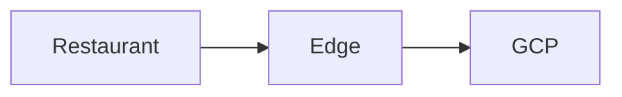

# Confluence Extraction Provider

This provider implements the extraction phase's Confluence-specific workflows:

- `publish`: push a local Markdown tree into Confluence
- `export`: pull a Confluence page or folder tree into a local Markdown workspace

## What This Repo Does

`kurate.py extract`:
- Walks a local folder tree and treats each Markdown file as a Confluence page.
- Uses each file's first `# H1` as the Confluence page title.
- Uploads local images as Confluence attachments.
- Renders Mermaid code fences to SVG attachments when `mmdc` is installed locally.
- Rewrites relative Markdown links to Confluence page links when the target page is part of the same sync.
- Writes a `confluence-map.json` manifest so later runs can update pages by stable page id.
- If the source folder is a git repo, attempts to stage and commit `confluence-map.json` automatically.
- Pulls a Confluence page or folder tree into a local folder tree.
- Writes page content as Markdown.
- Downloads attachments referenced by exported pages.
- Rewrites internal Confluence page links to relative Markdown links when possible.
- Writes `confluence-map.json` manifests and timestamped reports in `reports/`.

## Requirements

- Python 3.10+
- A Confluence Cloud API token
- Your Confluence account email
- The correct Confluence base URL, for example `https://mcd-tools.atlassian.net`

Important:
- Pass the site base URL without `/wiki`.
- Reports are written automatically to `reports/`, which is gitignored.
- Mermaid rendering is optional and requires local Mermaid CLI support via `mmdc`.

## Setup

Recommended:

```bash
./setup.sh
```

What `setup.sh` does:

- Creates or reuses `.venv`
- Installs `requirements.txt`
- Detects `mmdc` and tries to install Mermaid CLI with npm if it is missing
- Checks whether `confluence-identity.yaml` already exists and includes `api_key`
- Tells you what to do next only if no token is found

If `setup.sh` can install Mermaid CLI successfully, Mermaid diagrams will render as trimmed SVG attachments in Confluence.

Manual setup:

```bash
python3 -m venv .venv
source .venv/bin/activate
pip install -r requirements.txt
```

Recommended identity config at the repo root:

```yaml
confluence:
  base_url: https://mcd-tools.atlassian.net
  email: your.name@example.com
  api_key: your-token
```

Notes:

- The identity file is `confluence-identity.yaml` at the repo root.
- It is gitignored so you can keep your own email and local token there safely.
- `--base-url` and `--email` still work and override the identity file when passed.
- `api_key` in the YAML file is required for authenticated runs.

## Project Files

Project files define a whole effort, with Confluence extraction settings living under `phases.extraction`.

If a project defines a top-level `workspace`, relative local paths inside extraction resolve from that workspace instead of the repo root.

Example publish project:

```yaml
name: corp-segment-push
workspace: ../corp-segment-projects
phases:
  extraction:
    provider: confluence
    activity: publish

    source: .
    space: SA
    parent: 84969480
    excludes:
      - drafts/**
      - archive/**
      - "**/*.tmp.md"
    dry_run: false
```

Example export project:

```yaml
name: analytics-exports
workspace: ../analytics-exports
phases:
  extraction:
    provider: confluence
    activity: export
    metadata:
      - sidecar

    spaces:
      SA:
        pages:
          - id: 1647640729
            output: traffic-analysis
            recurse: true
            excludes:
              - 1647640999
              - 1647641000
          - id: 1723456789
            output: store-forecast

      OPS:
        pages:
          - id: 1987654321
            output: ops-playbook
            recurse: true
```

Run a publish project:

```bash
python3 kurate.py --project projects/corp-segment-push.yaml extract
```

Run an export project:

```bash
python3 kurate.py --project projects/analytics-exports.yaml extract
```

Notes:

- Relative paths in extraction projects resolve from the top-level `workspace` when it exists; otherwise they resolve from the repo root.
- Project files do not contain auth; authentication still comes from `confluence-identity.yaml`.
- Extraction projects must define `phases.extraction.provider: confluence`.
- Extraction activity names are `publish` and `export`.
- Publish projects should define `excludes` directly in the project file as glob patterns.
- Different publish projects may target the same source tree with different `excludes`.
- Export projects may set `phases.extraction.metadata` to `none`, a single value, or a list of outputs.
- Valid metadata outputs are `sidecar`, `file`, and `content-block`.
- `none` means no metadata outputs and may not be combined with other values.
- `sidecar` writes per-page `*.metadata.json` sidecars.
- `file` writes one `export.metadata.json` file at the export root for that target.
- `content-block` appends a clearly labeled Markdown metadata section at the end of each exported file with usefulness-focused signals.
- On rerun, existing metadata sidecars or `export.metadata.json` are used as a cache hint; when the stored Confluence `version` matches, the exporter skips rewriting that page, and attachment downloads are skipped only when the cached attachment metadata still matches the live Confluence attachment metadata.
- Export metadata includes rolling analytics windows computed fresh on each run: `year_to_date`, `trailing_year`, and `all_time_proxy`, each with `from_date`, `views`, and `unique_viewers`.
- Analytics reuse cached values when the stored windows are current for today; use `--force` to bypass that cache behavior.
- Export projects may define multiple spaces and multiple pages per space.
- Export page targets may define `excludes` to skip specific page ids and their descendants.
- If the root export page id appears in `excludes`, it is used as the traversal anchor but its own content is not written.
- Export page targets may use either a Confluence page id or a Confluence folder id as `id`.
- Recursive exports traverse Confluence content-tree folders and pages. Folders are exported as local directories only; they do not produce Markdown files because they do not have page body content.
- Each export page target runs independently and is summarized in the project report.

## Sync A Local Repo To Confluence

Run the unified script with a publish project file:

```bash
python3 kurate.py --project projects/corp-segment-push.yaml extract
```

Expected source conventions:

- Each Markdown file should have a leading `# Title`.
- A folder `readme.md` becomes that folder's page.
- Other Markdown files in the folder become child pages under that folder page.
- Publish exclusions should come from the project's `excludes` list of glob patterns.
- Mermaid fences like ```` ```mermaid ```` are rendered to SVG when `mmdc` is available; otherwise they are left as code blocks and called out in the report.

Example Mermaid block:

````md

````

## Export From Confluence To Markdown

Run the unified script with an export project file:

```bash
python3 kurate.py --project projects/analytics-exports.yaml extract
```

Reference page:

`https://mcd-tools.atlassian.net/wiki/spaces/SA/pages/1647640729/US+Restaurant+Next+Traffic+Analysis`

## CLI Reference

`kurate.py --project ... extract`:

- `--project`: required path to a YAML project file
- `--base-url`: optional override for the base URL
- `--email`: optional override for the auth email
- `--identity-config`: optional path to a YAML identity config file
- `--verbose` or `-v`: verbose logging
- `--force`: bypass cache hints and refresh the phase's work

Example:

```bash
python3 kurate.py --project projects/pull-old-segment-content.yaml extract
```

Other suite phases that commonly follow extraction:

- `python3 kurate.py --project projects/pull-old-segment-content.yaml analyze`
- `python3 kurate.py --project projects/pull-old-segment-content.yaml triage`

## Files The Tools Create

- `confluence-map.json`: stable page-id manifest written into the source or output tree
- `*.metadata.json`: optional export metadata files such as page sidecars or `export.metadata.json`
- `reports/*.md`: timestamped reports named as `[project]-[date]-[stage-activity].md`
- Exported pages with children or attachments use `slug/readme.md`, and any local attachments sit beside that `readme.md` in the same folder. Confluence folders become local directories containing their exported descendants.

For publish projects, if the source folder is inside a git repo, the tool will try to stage and commit `confluence-map.json` for you. You should still push that commit afterward.

Report filenames look like:

- `reports/publish-segment-2026-04-21_09-32-10-extract-publish.md`
- `reports/old-segment-content-2026-04-21_09-32-10-extract-export.md`
- `reports/old-segment-content-2026-04-21_09-32-10-extract-summary.md`

## Usage Notes

- Define repeatable projects in project YAML files and run the extraction phase with `kurate.py --project ... extract`.
- Do not include `/wiki` in `--base-url`.
- If `confluence-identity.yaml` exists at the repo root, both tools will use it for default `base_url`, `email`, and required `api_key`.
- The first `# H1` in each Markdown file becomes the Confluence page title.
- Review the generated report in `reports/` after each run.
